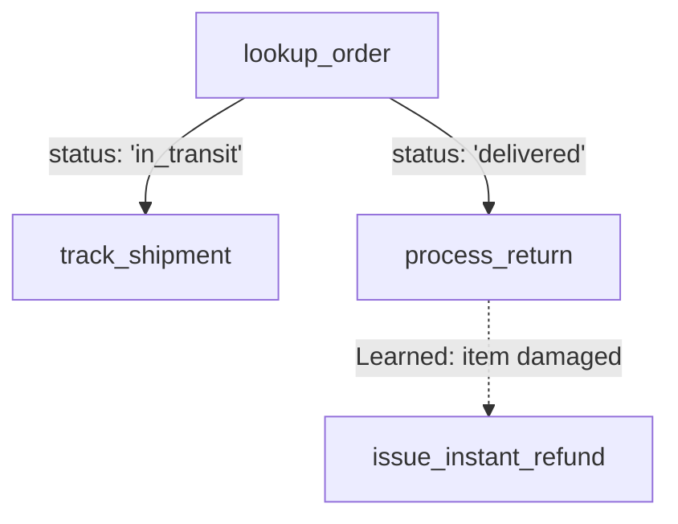

# Customer Support Agent Example

This example demonstrates an autonomous customer support agent handling order lookups, return processing, and dynamic refund handling.

See the complete runnable script at [`dendron/examples/email_agent_example.py`](file:///Users/sumanthmallya/Desktop/dendron/dendron/examples/email_agent_example.py).

## Workflow



## Running the Demo

```bash
python3 dendron/examples/email_agent_example.py
```
