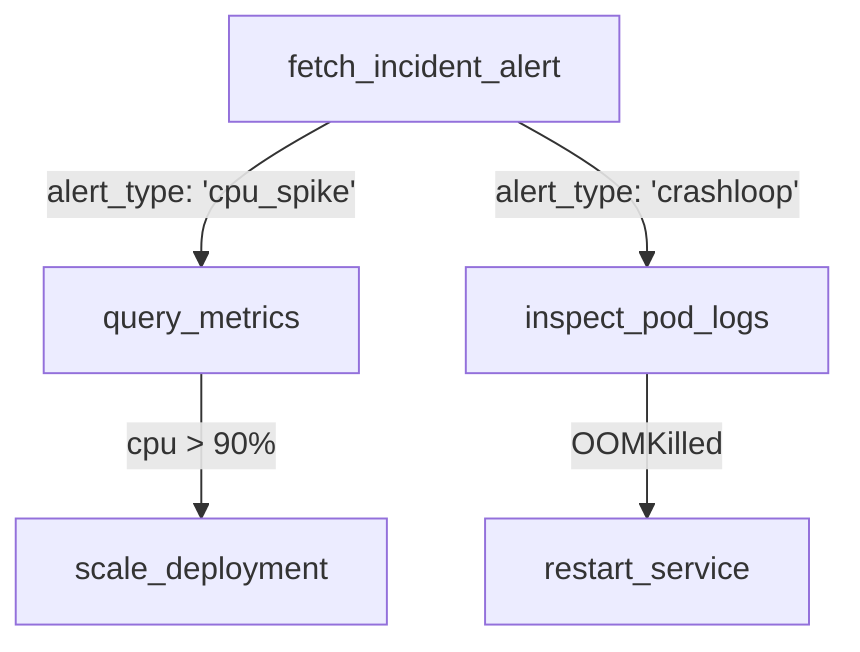

# DevOps & SRE Incident Agent Example

This example demonstrates an autonomous Site Reliability Engineering (SRE) agent triaging production incidents, analyzing metrics, and executing rollback or restarts.

See the complete runnable script at [`dendron/examples/devops_incident_agent.py`](file:///Users/sumanthmallya/Desktop/dendron/dendron/examples/devops_incident_agent.py).

## Workflow



## Running the Demo

```bash
python3 dendron/examples/devops_incident_agent.py
```
