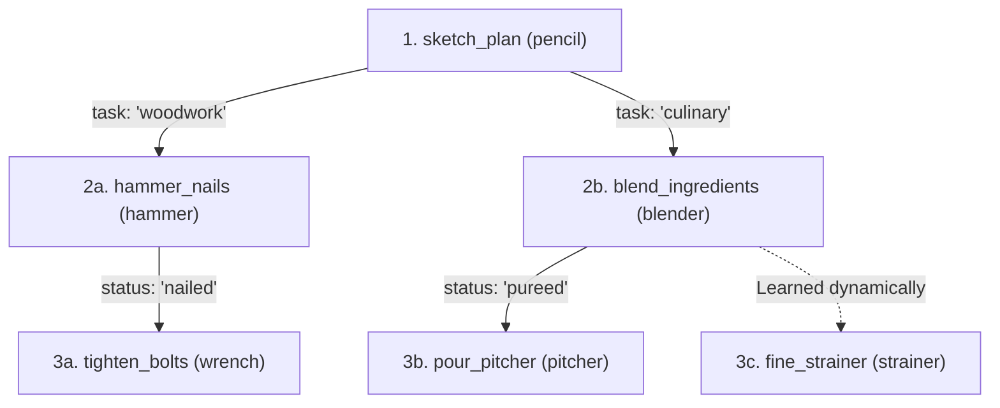

# Dendron

**An adaptive, tree-based tool execution and dynamic discovery library for AI agents.**

[-green.svg?style=flat)](#installation)

---

## Why Dendron? (Explained Simply)

### The Giant Backpack Problem
Imagine you are sitting at your desk, and someone dumps a giant 50-pound backpack containing **50 different tools** in front of you — a hammer, a blender, scuba goggles, a wrench, scissors, and a pencil.

Every time you just want to write your name, you have to dig through that giant pile. You get distracted, waste time, and might accidentally grab a hammer instead of a pencil!

In AI, that is how standard agent frameworks work today: they dump all 20 to 50 tools into the AI's prompt on every single turn. This creates two big problems:
1. **Wastes Brain Space (Tokens)**: The AI has to re-read descriptions of 50 tools over and over on every turn.
2. **Tool Selection Overload**: Searching through an unorganized pile of 50 tools slows down tool selection and makes it difficult to know which tool to pick next.

---

### How Dendron Fixes This (The "Choose-Your-Own-Adventure" Tree)

Instead of dumping a messy pile of 50 tools, **Dendron** organizes tools into a structured, step-by-step execution tree:

1. **Step-by-Step (Only See What You Need Right Now)**:
   The agent starts with only the initial tool on its workbench: `pencil` (`sketch_plan`). It doesn't need to see blenders, hammers, or wrenches yet.
2. **Follow the Clues (Branches)**:
   - If the task requires carpentry, Dendron branches to the `hammer` (`hammer_nails`), and only hands the `wrench` (`tighten_bolts`) when bolts need tightening.
   - If the task requires kitchen prep, Dendron branches to the `blender` (`blend_ingredients`), and only hands the `pitcher` (`pour_pitcher`) when pureed.
   - The agent never sees the blender when hammering, and never sees the hammer when blending!
3. **Learn New Tricks on the Fly**:
   If the agent discovers a recurring specialized need, it can dynamically attach a new tool right onto that branch (e.g. `fine_strainer` or `wood_chisel`).
4. **Ask in Plain English (RAG Search)**:
   If the agent ever needs an unusual tool from workshop storage, it can simply ask: *"Where is the torque wrench?"* and Dendron retrieves the exact tool in milliseconds.

---

## Key Highlights

- **Zero External Dependencies**: Built entirely with the Python standard library. No heavyweight requirements.
- **Framework-Agnostic**: Use with OpenAI, Anthropic Claude, Google Gemini, Ollama, LangChain, CrewAI, AutoGen, or vanilla Python.
- **Progressive Token-Tiered Views**: Drops tool prompt size by up to **93%**, making local/edge models (Apple Foundation Models, MLX) lightning fast.
- **Model Context Protocol (MCP) Native**: Seamlessly import from and export to standard MCP servers and clients.
- **Dynamic Experience Learning**: Automatically records learned workflows and suppresses rejected actions.
- **DAG & Tree-of-Trees**: Supports multi-domain orchestrators and converging workflow paths.
